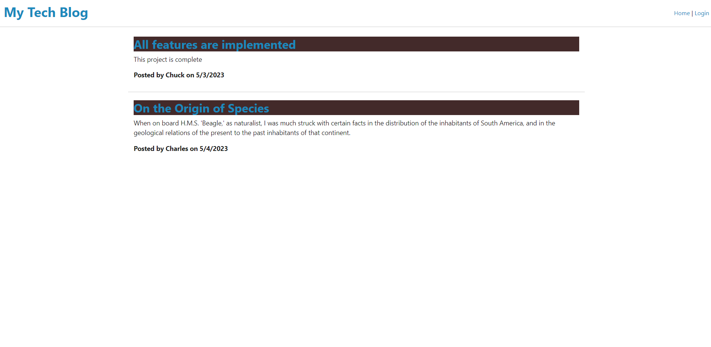
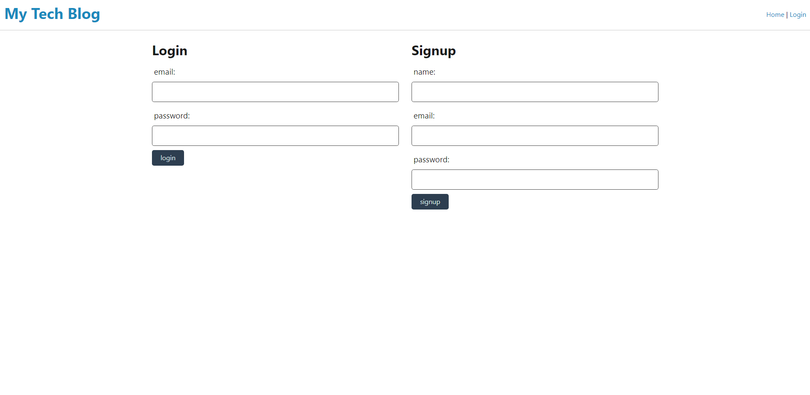
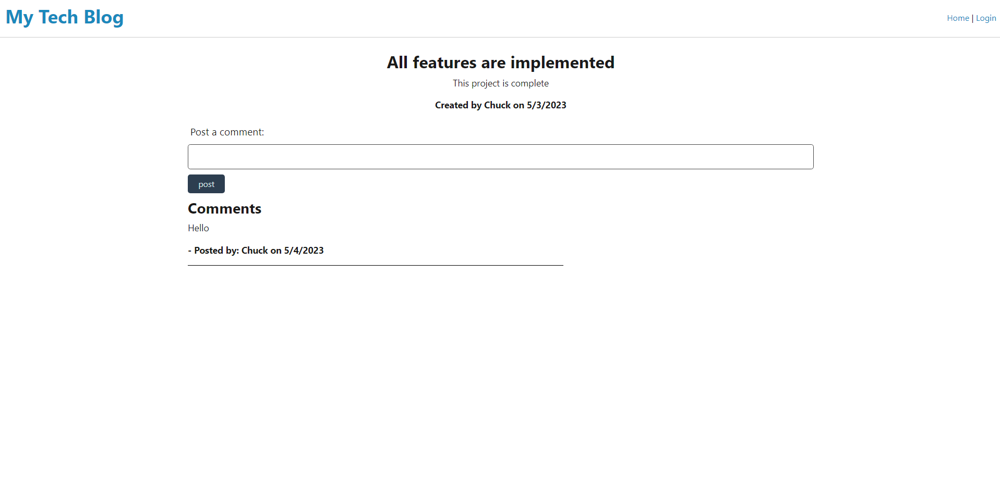

# MVC Tech Blog

## Description

This application is a blog website created following the Model-View-Controller pattern.

## Table of Contents

- [Screenshots](#screenshots)

- [Installation](#installation)

- [Usage](#usage)

- [License](#license)

- [Contributing](#contributing)

- [Questions](#questions)

- [Link](link)

## Screenshots

## Installation

To install the application, run npm init in the terminal and create a proper .env file.

## Usage

To use this application create an account and view, comment, or create your own blog posts.

## License

The license being used for this application is the MIT license.

## Contributing

Much of the code for this project was borrowed from the Unit 14 mini project.

## Questions

If you have any questions feel free to reach out to me at my email nnamdionyeije@gmail.com or through my GitHub at [https://github.com/nnamdionyeije](https://github.com/nnamdionyeije/).

## Link

https://protected-springs-88869.herokuapp.com/
